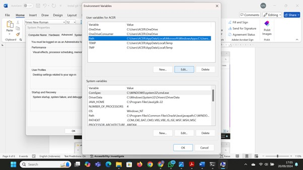
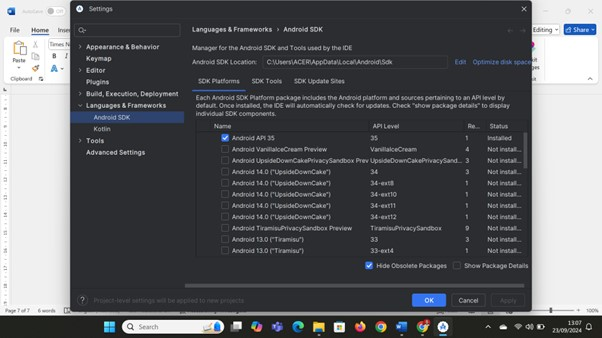
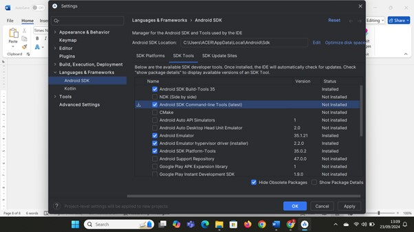
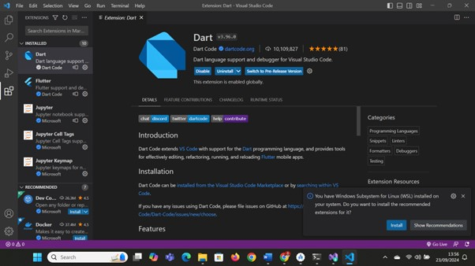
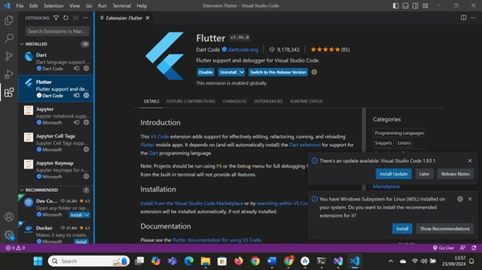

# PPB_MariaNathasyaDesferaPangestu/01_Running-Modul/LP_01

<li> Nama   : MariaNathasyaDesferaPangestu
<li> NIM    : 2211104008
<li> Kelas  : SE-06-01

# Instalasi Git
<li> Bukti screenshot sudah menginstal git melalui cmd

# Instalasi JDK
<li> Bukti screenshot sudah menginstal jdk melalui cmd

# Instalasi Android Studio dan SDK
<li> Bukti screenshot sudah menginstal android studio dan juga sdk 

 

# Instalasi Visual Studio Code dan Extensions
<li> Bukti screenshot sudah menginstal visual studio code dan juga extensions Dart dan Flutter

 

