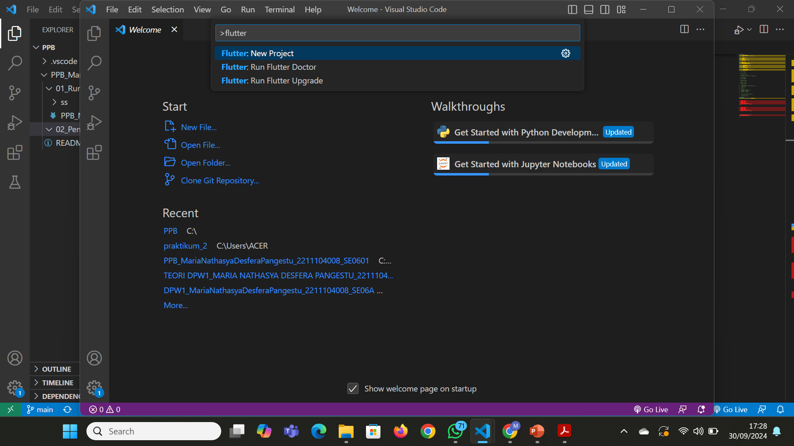

# PPB_MariaNathasyaDesferaPangestu_2211104008_SE0601

<li> Nama   : MariaNathasyaDesferaPangestu
<li> NIM    : 2211104008
<li> Kelas  : SE-06-01

1.	Penjelasan dari Dart & Flutter beserta contoh widget yang ada pada Flutter.
Dart adalah bahasa pemrograman yang dikembangkan oleh Google, fokusnya pada pengembangan aplikasi yang cepat, efisien, dan mudah dipelihara. Memiliki sintaks yang mirip dengan bahasa pemrograman C# dan Java. Keunggulan Dart adalah dapat dikompilasi menjadi kode native, memungkinkan aplikasi berjalan dengan performa tinggi di perangkat mobile dan web.
Flutter adalah toolkit UI yang juga dikembangkan oleh Google, memungkinkan pengembang membangun aplikasi mobile, web, dan desktop dari satu basis kode. Flutter menggunakan Dart sebagai bahasa pemrograman utamanya, sehingga kedua teknologi ini saling melengkapi.
•	Text: Widget untuk menampilkan teks. 
•	Container: Widget untuk mengatur tata letak dan styling suatu elemen. 
•	Row: Widget untuk mengatur elemen secara horizontal. 
•	Column: Widget untuk mengatur elemen secara vertikal. 
•	Image: Widget untuk menampilkan gambar. 
•	ElevatedButton: Widget untuk membuat tombol. 
•	TextField: Widget untuk membuat input teks. 
•	Scaffold: Widget yang menyediakan struktur dasar untuk aplikasi. 
•	AppBar: Widget untuk membuat app bar. 
•	Drawer: Widget untuk membuat drawer navigasi.

2. Langkah-langkah:
pertama buka vs code, lalu ketik ctrl + shift + P secara bersamaan. Setelah muncul tulisan flutter di klik. Lalu pilih Application. Lalu pilih folder untuk menyimpan projek flutter. Setelah itu pilih projek flutternya. Kemudian pilih device flutter dan tampilan awalnya akan seperti gambar yang tertera.

3. Berikut ini tampilan awal flutternya.

4. Setelah berhasil, modifikasi halaman diatas untuk menampilkan biodata
kalian, minimal 5 widget!! (bebas, buatlah sekreatif mungkin).
Jawab: 

