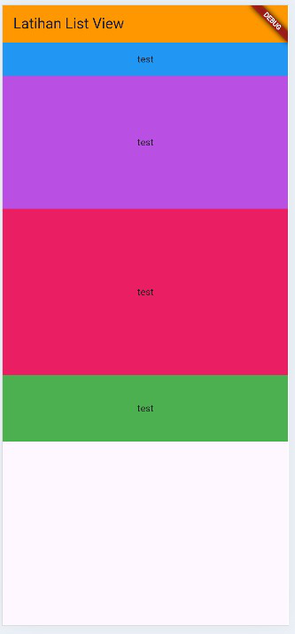
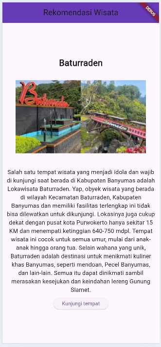
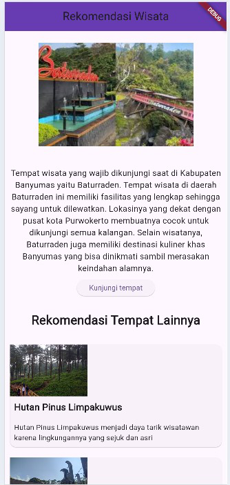

# PPB_MariaNathasyaDesferaPangestu_2211104008_SE0601
TUGAS PENDAHULUAN
PEMROGRAMAN PERANGKAT BERGERAK
MODUL IV 
ANTARMUKA PENGGUNA

Disusun Oleh:
Maria Nathasya Desfera Pangestu/2211104008
SE0601

Asisten Praktikum:
Muhammad Faza Zulian Gesit Al Barru
Aisyah Hasna Aulia

Dosen Pengampu:
Yudha Islami Sulistya, S.Kom., M.Cs.

PROGRAM STUDI S1 SOFTWARE ENGINEERING
FAKULTAS INFORMATIKA
TELKOM UNIVERSITY PURWOKERTO
2024

GUIDED
Main Dart
Kode program untuk main dart:

Kode program untuk list_view:

Outputnya:

TP
Kode program untuk tp_04:

Output dari tp_04:

UNGUIDED
Soal:
1. Modifikasi project TP 04 (Tugas Pendahuluan) untuk Antarmuka Pengguna, yang mana di dalamnya terdapat ListView, untuk merekomendasikan beberapa tempat wisata yang ada di Banyumas disertai foto, nama wisata, dan deskripsi singkat! (buatlah se kreatif mungkin).

Screenshot kode programnya:

Source code:
import 'package:flutter/material.dart';

void main() {
  runApp(const MyApp());
}

class MyApp extends StatelessWidget {
  const MyApp({super.key});

  @override
  Widget build(BuildContext context) {
    return MaterialApp(
      title: 'Rekomendasi Wisata',
      theme: ThemeData(
        colorScheme: ColorScheme.fromSeed(seedColor: Colors.deepPurple),
        useMaterial3: true,
      ),
      home: const MyHomePage(title: 'Rekomendasi Wisata'),
    );
  }
}

class MyHomePage extends StatefulWidget {
  const MyHomePage({super.key, required this.title});

  final String title;

  @override
  State<MyHomePage> createState() => _MyHomePageState();
}

class _MyHomePageState extends State<MyHomePage> {
  final List<Map<String, String>> places = [
    {
      'name': 'Hutan Pinus Limpakuwus',
      'description':
          'Hutan Pinus Limpakuwus menjadi daya tarik wisatawan karena lingkungannya yang sejuk dan asri',
      'image':
          'https://www.mongabay.co.id/wp-content/uploads/2019/06/2-Pengunjung-melewati-jembatan-kayu-saat-berjalan-jalan-di-hutan-pinus-Limpakuwus.jpg'
    },
    {
    'name': 'Taman Botani Baturaden',
      'description':
          'Taman Botani Baturaden memiliki banyak jenis tanaman yang menjadi daya tarik dan sarana edukasi bagi orang-orang yang memiliki ketertarikan dengan tanaman.',
      'image':
          'https://asset.kompas.com/crops/SQjbWUVze-YoIn04en8G6oYvSbY=/0x84:1000x751/750x500/data/photo/2023/12/17/657ed9df16dc3.jpg'
    },
  ];

  @override
  Widget build(BuildContext context) {
    return Scaffold(
      appBar: AppBar(
        backgroundColor: Colors.deepPurple,
        title: Text(widget.title),
        centerTitle: true,
      ),
      body: SingleChildScrollView(
        child: Column(
          children: [
            Container(
              child: Center(
                child: Text(
                  "Baturraden",
                  style: TextStyle(
                    fontSize: 24,
                    fontWeight: FontWeight.bold,
                  ),
                ),
              ),
            ),
            Container(
              padding: EdgeInsets.all(30),
              child: Image.network(
                "https://encrypted-tbn0.gstatic.com/images?q=tbn:ANd9GcQ7QiZOLaguBIy2EpPvBNPYvmH8D5mbC0WQsA&s'",
                width: 300,
                height: 200,
                fit: BoxFit.cover,
              ),
            ),
            Container(
              padding: EdgeInsets.all(10),
              child: Text(
                "Tempat wisata yang wajib dikunjungi saat di Kabupaten Banyumas yaitu Baturraden. Tempat wisata di daerah Baturraden ini memiliki fasilitas yang lengkap sehingga sayang untuk dilewatkan. Lokasinya yang dekat dengan pusat kota Purwokerto membuatnya cocok untuk dikunjungi semua kalangan. Selain wisatanya, Baturraden juga memiliki destinasi kuliner khas Banyumas yang bisa dinikmati sambil merasakan keindahan alamnya.",
                textAlign: TextAlign.center,
                style: TextStyle(fontSize: 16),
              ),
            ),
            
            Container(
              margin: EdgeInsets.only(bottom: 30),
              child: ElevatedButton(
                onPressed: () {
                  ScaffoldMessenger.of(context).showSnackBar(
                    const SnackBar(content: Text("Menuju ke Baturraden")));
                  },
                child: const Text("Kunjungi tempat")
              ),
            ),
            Container(
              margin: EdgeInsets.only(bottom: 20),
              child: Text(
                "Rekomendasi Tempat Lainnya",
                style: TextStyle(
                  fontSize: 24,
                  fontWeight: FontWeight.bold,
                ),
              ),
            ),

            Container(
              height: 450,
              child: ListView.builder(
                scrollDirection: Axis.vertical,
                itemCount: places.length,
                itemBuilder: (context, index) {
                  return Card(
                    margin: const EdgeInsets.all(10),
                    child: Column(
                      crossAxisAlignment: CrossAxisAlignment.start,
                      children: [
                        Image.network(
                          places[index]['image']!,
                          width: 150,
                          height: 100,
                          fit: BoxFit.cover,
                        ),
                        Padding(
                          padding: const EdgeInsets.all(8.0),
                          child: Text(
                            places[index]['name']!,
                            style: const TextStyle(
                              fontSize: 18,
                              fontWeight: FontWeight.bold,
                            ),
                          ),
                        ),
                        Padding(
                          padding: const EdgeInsets.all(8.0),
                          child: Text(
                            places[index]['description']!,
                            style: const TextStyle(fontSize: 14),
                          ),
                        ),
                      ],
                    ),
                  );
                },
              ),
            ),
          ],
        ),
      ),
    );
  }
}

Screenshot Output:

Deskripsi Program:
Program ini menampilkan rekomendasi tempat wisata di Baturaden melalui aplikasi yang memiliki AppBar berjudul "Rekomendasi Wisata" di layar beranda. Aplikasi ini menggunakan widget Column untuk menampilkan komponen seperti Text untuk nama tempat wisata, Image.network untuk gambar dari URL, dan deskripsi singkat tempat wisata. Di bawahnya terdapat tombol "Kunjungi Tempat" yang mengarahkan pengguna ke halaman detail informasi. Dengan ListView.builder, aplikasi ini dapat menampilkan beberapa tempat wisata di Banyumas, di mana setiap objek wisata disajikan dalam daftar yang mencakup nama, deskripsi, dan URL gambar. Setiap item wisata ditampilkan menggunakan widget Card untuk mempercantik tampilan, yang berisi gambar, nama, deskripsi, dan tombol untuk tindakan selanjutnya. Program ini dapat diperluas dengan menambahkan lebih banyak data wisata atau menyesuaikan antarmuka pengguna sesuai kebutuhan.
