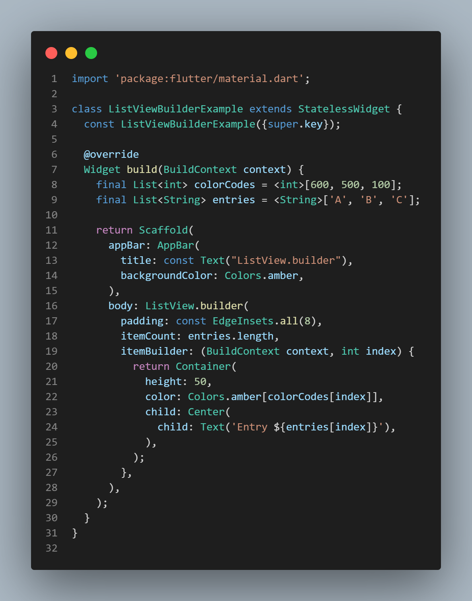
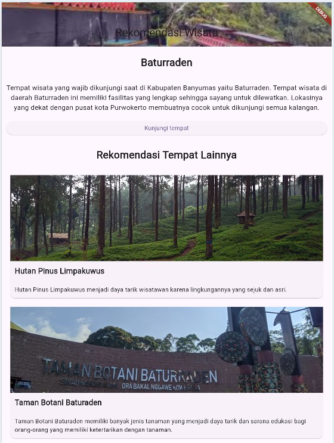

# PPB_MariaNathasyaDesferaPangestu_2211104008_SE0601

# TUGAS PENDAHULUAN  
## PEMROGRAMAN PERANGKAT BERGERAK  
### MODUL IV   
### ANTARMUKA PENGGUNA

### Disusun Oleh:  
**Maria Nathasya Desfera Pangestu / 2211104008**  
SE0601

### Asisten Praktikum:  
**Muhammad Faza Zulian Gesit Al Barru**  
**Aisyah Hasna Aulia**

### Dosen Pengampu:  
**Yudha Islami Sulistya, S.Kom., M.Cs.**

### PROGRAM STUDI S1 SOFTWARE ENGINEERING  
### FAKULTAS INFORMATIKA  
### TELKOM UNIVERSITY PURWOKERTO  
2024

GUIDED
1. ListView.builder
Source code:

Outputnya:

2. ListView.Separated
Source code:

Outputnya:

3. Flexible and Expanded
Source code:

Outputnya:

4. CustomScroll.View
Source code:

Outputnya:

UNGUIDED
Source code:

Outputnya:

Deskripsi:
Halaman utama berisi gambar dari tempat wisata, judul, deskripsi singkat, ditampilkan berbentuk kartu dan ada tombol "kunjungi tempat". Rekomendasi wisata ini ditampilkan dengan tampilan yang bisa di scroll dan bagian homenya memakai widget Scaffold. Pada tampilan ini memakai beberapa widget yaitu SilverList, SilverAppBar, dan CustomScrollView. Setiap itemnya memakai widget Container, Coloumn, Image.asset, Text, dan juga ElevatedButton.
