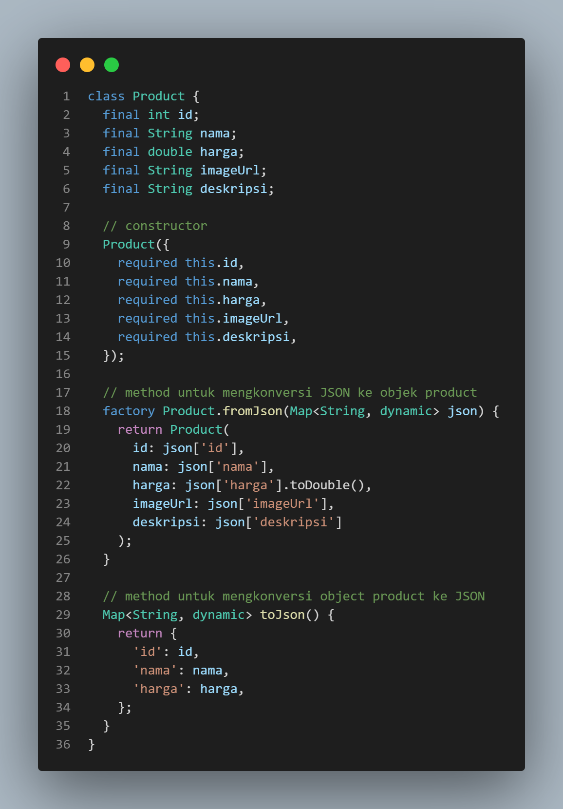
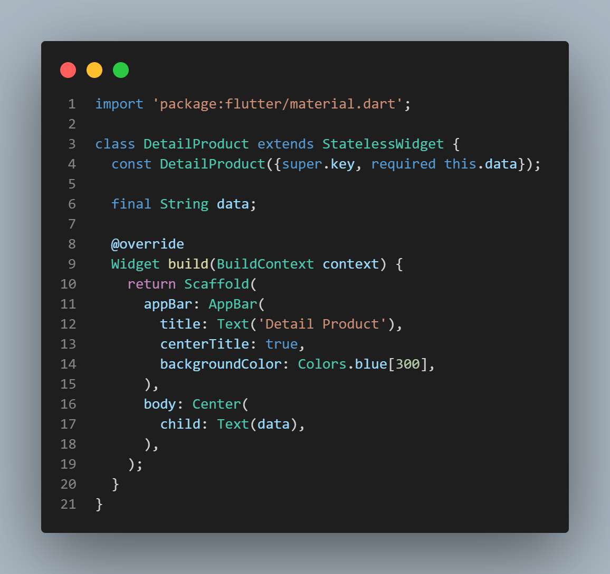
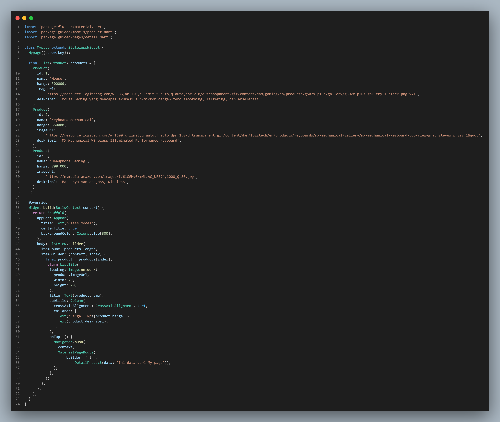
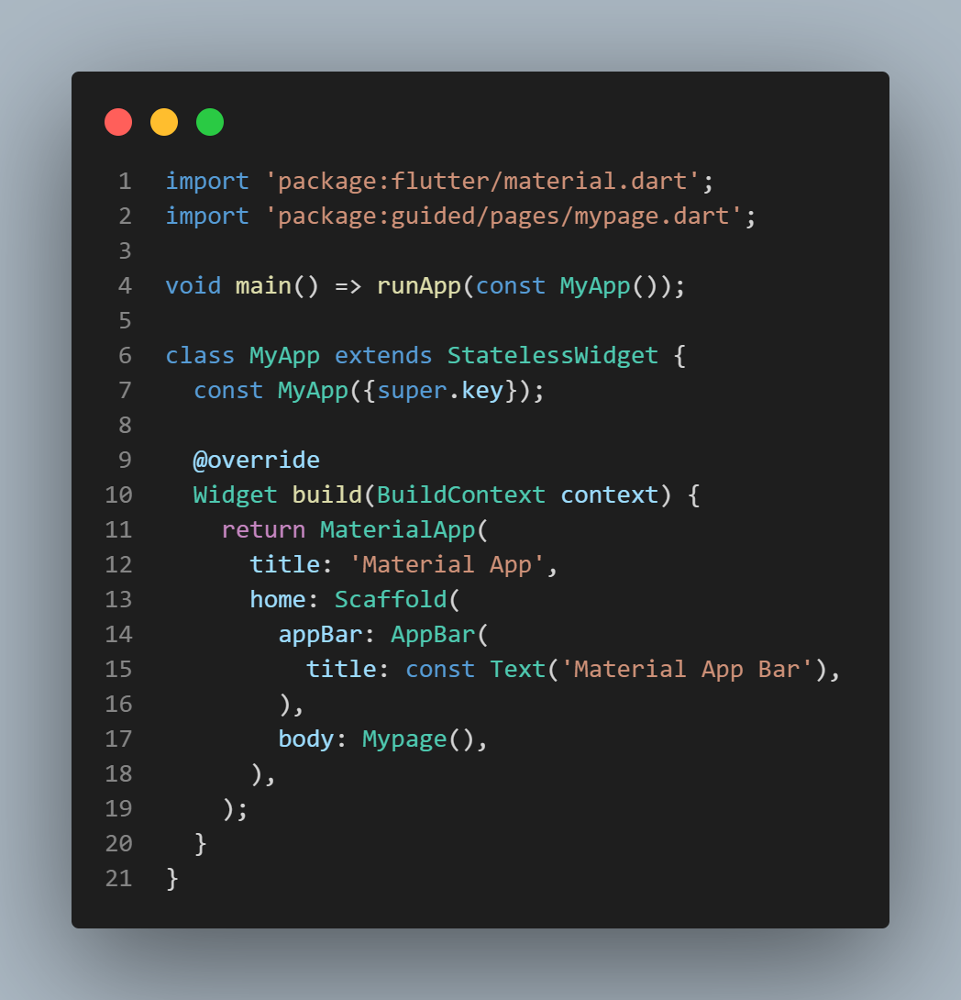
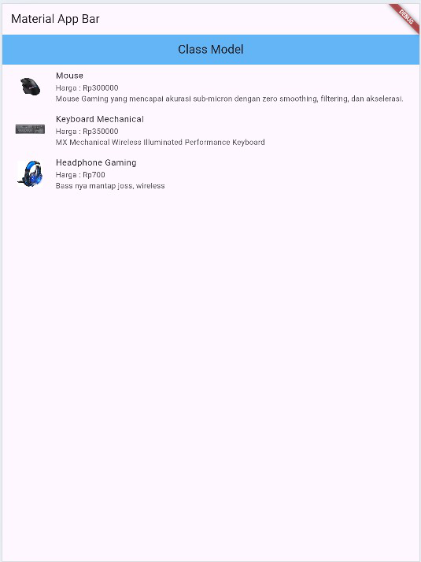
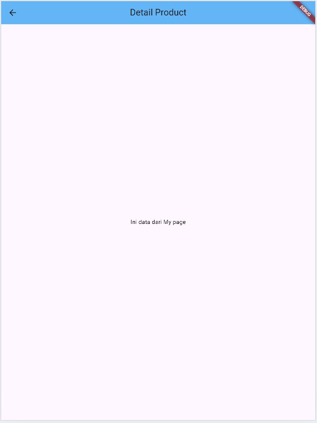

# PPB_MariaNathasyaDesferaPangestu_2211104008_SE0601

# TUGAS PENDAHULUAN  
## PEMROGRAMAN PERANGKAT BERGERAK  
### MODUL IV   
### ANTARMUKA PENGGUNA

### Disusun Oleh:  
**Maria Nathasya Desfera Pangestu / 2211104008**  
SE0601

### Asisten Praktikum:  
**Muhammad Faza Zulian Gesit Al Barru**  
**Aisyah Hasna Aulia**

### Dosen Pengampu:  
**Yudha Islami Sulistya, S.Kom., M.Cs.**

### PROGRAM STUDI S1 SOFTWARE ENGINEERING  
### FAKULTAS INFORMATIKA  
### TELKOM UNIVERSITY PURWOKERTO  
2024

GUIDED
1. Product
Source code:

2. Detail
Source code:

3. Mypage
Source code:

4. Main.dart
Source code:

Output keseluruhannya:

 

